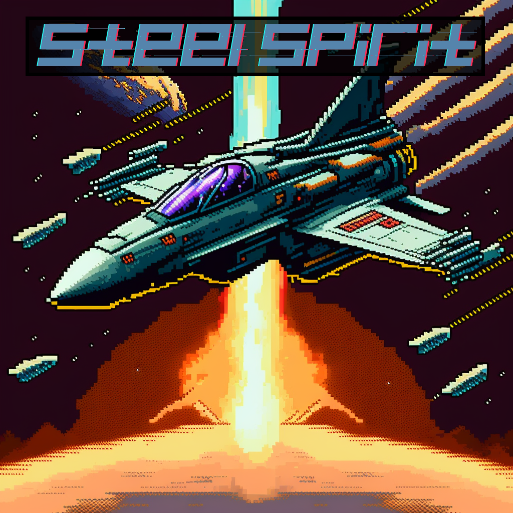

# STEEL SPIRIT

## A TwinStick,Shmup RPG hybrid    

In progress, lots yet to be done. 

## TODO   

- TOGGLE ABILITIES FOR FLY
- ROTATE + JINK
- UDLR + ROTATE 
- ++ HOR SPEED
- ++ VER SPEED
- ++ CANVAS SPEED

  
# Notes  

DRAW MORE UNITS

GOAL: NO STORY until game is playable and fun GOAL: Do 2 way pivot, shmup to open

SCENE

FEATURES:

DONE: make and render player DONE: Do a simple map DONE: Navigate with aswd DONE: Camera Nav

fire weapon

make enemy

make enemy simple logic

make enemy fire

destroy enemy scene

Deduct Health

Helicopter mode in atmo

MUST HAVE: After burners

MUST HAVE: Jink DODGE

Shmup into open world

Redo omega storm including canvas

Camera shake

later
Team ally players
BIG SCENE 0 - FURBALL

Training/competition scene

cats, dogs, apes
They have sleek fast ships, chase em to locations and clean up before them

mild plot about slipgates

Lock on fights

BIG SCENE 1 - DREADNAUGHT

Timer in big, 'x until end of earht, shrinks to top right'
battlship preview before coming to you
MASSIVE EXPLOSIONS, AIM BIGGER THAN THE REST
Beat the ship, then give a triumphant intro..Adam proudly presents etc
Use UDM names, Turov etc
make a big tutorial
go here
shoot this
use chaff
repeat